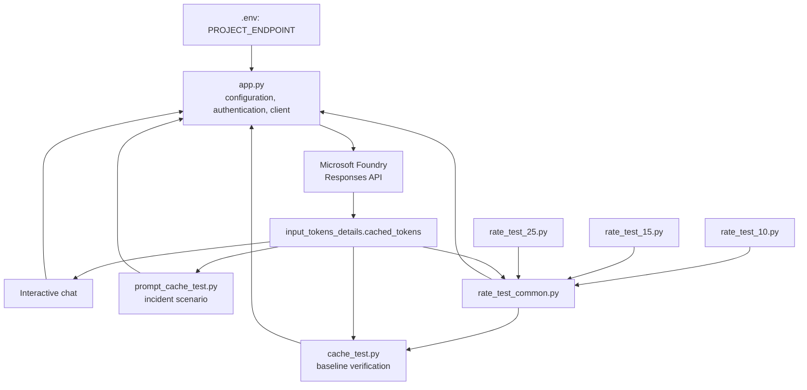

# Prompt caching demo — Foundry `gpt-5-mini`

A minimal terminal demo that exercises and verifies **Azure OpenAI prompt
caching** on a `gpt-5-mini` deployment in a Microsoft Foundry project, via the
Responses API (`azure-ai-projects` → `get_openai_client()`).

- [app.py](app.py) — interactive chat. Follow-up prompts retain the context of
  earlier responses (via `previous_response_id`) for the life of the process,
  and each reply prints a cache-usage line.
- [cache_test.py](cache_test.py) — automated check that a long, identical prompt
  prefix produces cache reads. Exit code `0` = PASS, `1` = FAIL, `2` = config
  error.
- [prompt_cache_test.py](prompt_cache_test.py) — incident-response scenario that
  reports request-level and token-weighted cache ratios across one warm-up write
  and ten read attempts.
- [rate_test_common.py](rate_test_common.py) — shared sequential harness for the
  10, 15, and 25 requests/minute rate-test runners.

## Architecture



## Deployment facts

Private identifiers are redacted below; local configuration is covered in
[Secrets and private values](#secrets-and-private-values).

| Item | Value |
| --- | --- |
| Resource group | `***` |
| Foundry account | `***` |
| Foundry project | `***` |
| Model / version | `gpt-5-mini` / `2025-08-07` |
| SKU | GlobalStandard |
| Capacity | 252 |
| Supported APIs | Chat Completions, Responses, Agents V2, Assistants |
| Project endpoint | `https://***.services.ai.azure.com/api/projects/***` |

## Prerequisites

- Python 3.10 or later
- Azure CLI
- Access to your Foundry project and its model deployment

## Set up

Run these commands in PowerShell from this directory:

```powershell
python -m venv .venv
.\.venv\Scripts\Activate.ps1
python -m pip install --upgrade pip
python -m pip install -r requirements.txt
Copy-Item .env.example .env
az login
```

If your account has access to multiple Azure subscriptions, select the one that
contains your Foundry resource group:

```powershell
az account set --subscription "<subscription name or ID>"
```

Then edit `.env` and set `PROJECT_ENDPOINT` to your real Foundry project endpoint
(the committed `.env.example` ships only with a `<placeholder>` template; the real
value is in `SECRETS.local.md`).

## Secrets and private values

Keep the real project endpoint in `.env` and private resource identifiers in
`SECRETS.local.md`. Both files are excluded by `.gitignore`; only the redacted
deployment facts and placeholder `.env.example` belong in source control.

## Run the chat app

```powershell
python app.py
```

Enter a prompt and then a dependent follow-up, such as:

```text
You: What is the capital of France?
You: Summarize that answer in three words.
```

Type `exit` or `quit`, or press `Ctrl+C`, to end the session.

## Run the cache test

```powershell
python cache_test.py
```

The test sends a fixed ~2,000-token prefix plus a short, varying question four
times, then reports per-turn `input_tokens` / `cached_tokens`.

Run the separate incident-response scenario with:

```powershell
python prompt_cache_test.py
```

This test uses a different stable prompt and cache key, sends one warm-up write
followed by ten cache-read attempts, and reports both metrics used by the rate
tests. The request-level ratio excludes the warm-up; the token-weighted ratio
includes all successful requests.

## Run the rate tests

The rate runners target 10, 15, and 25 requests per minute for approximately two
minutes each:

```powershell
python rate_test_10.py
python rate_test_15.py
python rate_test_25.py
```

They use distinct cache keys and report achieved throughput, a request-level
cache-hit ratio, and a token-weighted cache ratio
(`SUM(cached_tokens) / SUM(input_tokens)`). See
[tests-summary.md](tests-summary.md) for the verified results and the
sequential-dispatch limitation.

## How prompt caching works

- `cached_tokens` is only non-zero once at least **1,024 identical leading
  tokens** are reused; hits then extend in 128-token increments.
- The chat app and baseline cache test send
  `prompt_cache_key="prompt-cache-demo"`; the focused and rate tests use isolated
  keys. All runners use `prompt_cache_retention="in_memory"` for stable routing.
  Extended (24h) retention is intentionally **disabled** and is not listed as
  supported for `gpt-5-mini`.
- After each response, `app.py` prints a line read from
  `response.usage.input_tokens_details.cached_tokens`:

  ```text
  [cache] 1920/2021 input tokens served from cache
  ```

- In the interactive app, short prompts show `[cache] 0/<n>` on early turns; hits
  appear once the accumulated conversation prefix grows past ~1,024 tokens.

## Verified results

In-memory prompt caching was verified with the current runners:

- Baseline (2026-07-18): 3/3 post-warm-up requests served 1,920 cached
  tokens from inputs of approximately 2,021 tokens.
- Incident scenario (2026-07-20): 10/10 post-warm-up requests were cache hits;
  88.6% of all input tokens, including the warm-up write, came from cache.
- Rate tests (2026-07-20): target rates were 10, 15, and 25 requests/minute,
  but sequential dispatch achieved only 9.6–10.2 requests/minute. Behavior above
  approximately 15 requests/minute therefore remains unverified.

See [tests-summary.md](tests-summary.md) for the methodology, complete
measurements, metric definitions, and limitations. Reproduce the baseline with
`az login` followed by `python cache_test.py`.

## Caveats & limits

- The **in-memory cache expires** after 5–10 min of inactivity (and always within
  1 hour), so a re-run after a long gap shows `cached_tokens = 0` on turn 1 again.
- A change within the identical cached prefix can force a cache miss.
- [Microsoft Learn](https://learn.microsoft.com/azure/foundry/openai/how-to/prompt-caching)
  notes that some requests might miss the cache when the same prefix and
  `prompt_cache_key` exceed approximately **15 requests/min**. The current
  sequential rate tests were latency-bound at about 10 requests/min, so they did
  not verify that boundary.
- Caches are **not shared across Azure subscriptions**.
